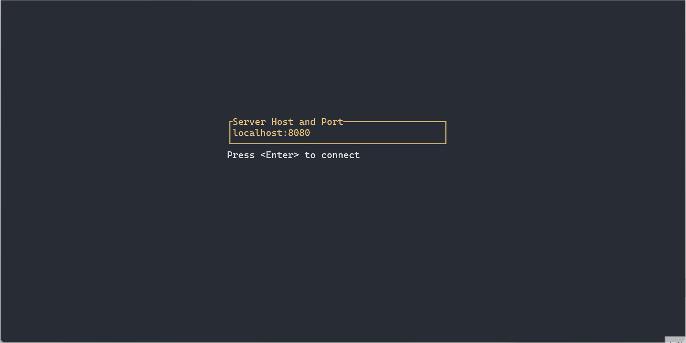

# Crab Bubble

초기 버전은 https://github.com/Yengas/rust-chat-server 에서 fork 했습니다.

## 설정하기

1. 저장소를 클론합니다.
2. Rust 와 Cargo 설치가 안 되어 있다면 합니다. [Rust and Cargo](https://www.rust-lang.org/tools/install)
3. 저장소 루트로 들어갑니다.
4. 서버는 cargo run --bin server 로 실행합니다. 혹은 cd server 하고 cargo run 해도 됩니다.
5. 클라이언트는 cargo run --bin tui 로 실행합니다. 혹은 cd tui 하고 cargo run 해도 됩니다.

## 알아두기
- 기본 포트는 8080 포트입니다.
- HTTP 프로토콜이 아닙니다.

## 사용하기
- 클라이언트에서 처음 보이는 화면에서 서버 주소를 입력합니다. IP혹은 도메인 이름과 포트를 붙여 씁니다.
- 방향키로 박스 섹션을 돌아다닐 수 있습니다.
- 처음에는 좌측 박스로 가서 채팅방을 선택해야 합니다.
  - 좌측 키로 채팅방 리스트로 간 다음에 e키를 눌러 선택 모드로 들어가고 위/아래 키로 이동한 뒤, 엔터를 누르면 입장합니다.
  - 그 뒤에 다시 우측 키로 메시지 입력 박스로 가서 e키를 누르면 메시지를 입력할 수 있습니다.
  - 입력하고 엔터를 치면 서버로 메시지를 전송합니다.
- 나가려면 ESC, 그리고 q를 누릅니다.

## 프로젝트 둘러보기

The project utilizes Rust Workspaces to divide itself into three sub-projects, each with its own README that details the concepts and architecture. Below is a brief overview:

- [comms](./comms/): This sub-project houses a library crate that provides Events and Commands used for server-client communication. It also offers client/server socket utilities, enabled via feature flags, to assist in serializing and deserializing events and commands.
- [server](./server/): Built on the [Tokio Runtime](https://tokio.rs/) and using [Tokio Channels](https://tokio.rs/tokio/tutorial/channels), this sub-project implements a single-instance chat server that manages room states and user participation.
- [tui](./tui/): Leveraging [Ratatui](https://github.com/ratatui-org/ratatui), this sub-project implements a terminal-based user interface. Users can connect to a chat server, join rooms, and send/receive messages. The code follows a Redux-inspired structure to separate state management from TUI rendering.

## License

The project is distributed under the [MIT License](./LICENSE).
